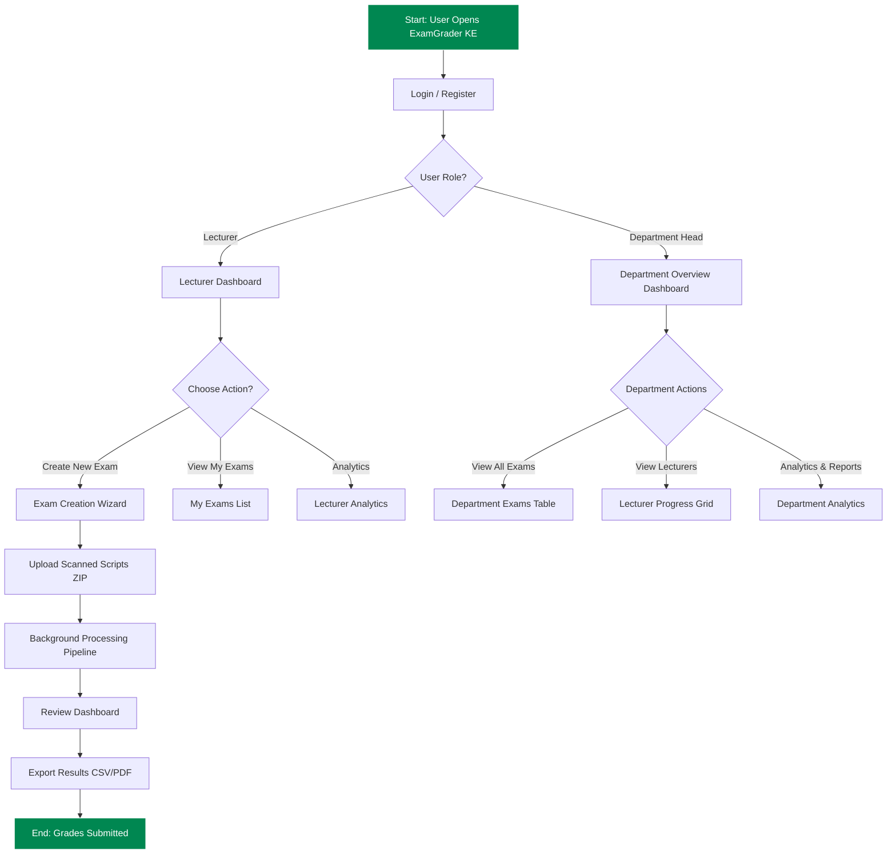
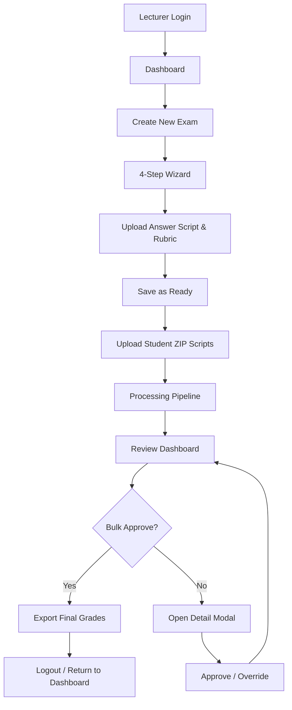
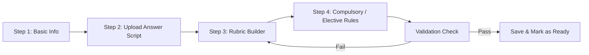
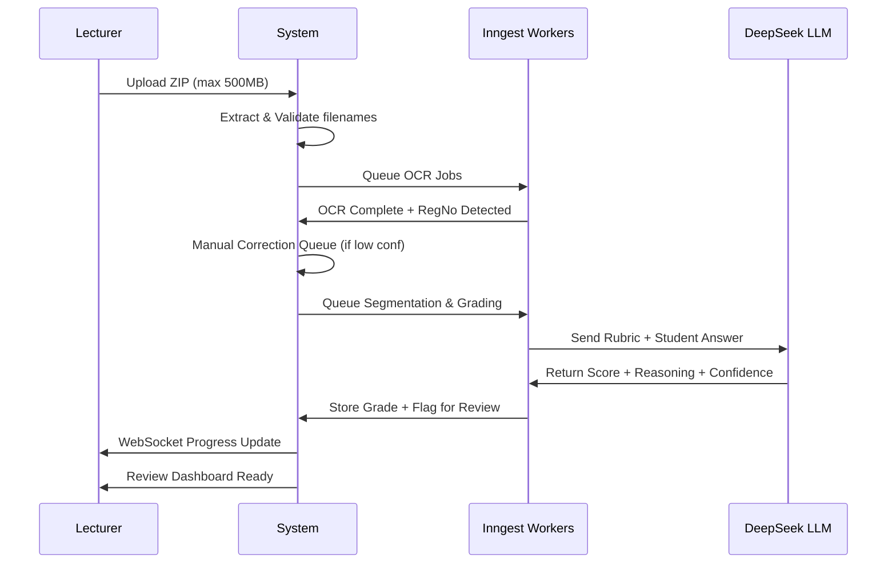
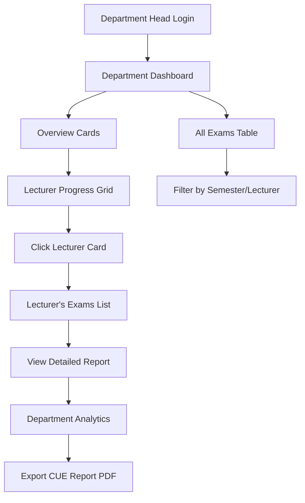

### 1. High-Level System User Flow (Overview)

The diagram above shows the complete entry points and main paths for both primary users.

---

### 2. Lecturer End-to-End Workflow (Most Common Path)

This is the **core daily flow** a lecturer follows during exam season.

**Step-by-step narrative:**
1. Logs in → sees Dashboard with pending reviews highlighted.
2. Clicks **New Exam** → completes 4-step wizard (Basic Info → Answer Script → Rubric → Question Rules).
3. Uploads batch of scanned student papers (ZIP).
4. Watches real-time Processing Dashboard (OCR → Segmentation → LLM Grading).
5. Goes to **Review Dashboard** → uses smart queue + bulk approve high-confidence grades.
6. Reviews only low-confidence items in modal (side-by-side scan + OCR + AI reasoning).
7. Exports CSV (or PDF) → submits to university system.

---

### 3. Exam Creation Wizard Flow (Detailed)

**4-Step Guided Wizard** (takes ~10–15 minutes for first-time users):

- **Step 1**: Course code, semester, total marks.
- **Step 2**: Upload model answer script (PDF/image).
- **Step 3**: Dynamic rubric builder (add criteria + marks per question).
- **Step 4**: Mark compulsory questions + elective rules.
- Final validation before the exam becomes “Ready for Upload”.

---

### 4. Core Processing & Review Flow (Technical + User View)

This is the **heart of the system** — fully automated until review.

**Key Automatic Steps:**
1. ZIP upload → file extraction
2. Image preprocessing + PaddleOCR
3. Registration number detection
4. Question segmentation & validation
5. LLM grading with confidence scoring
6. Smart review queue generation
7. Real-time WebSocket notifications

---

### 5. Department Head Oversight Flow

Department Heads have **read-only elevated visibility** across their entire department.

**Typical flow:**
1. Login → Department Overview Dashboard.
2. See real-time stats: total students processed, auto-approval rate, time saved.
3. Browse Lecturer Progress Grid (cards showing each lecturer’s completion % and pending reviews).
4. Drill into any lecturer’s exams.
5. View aggregated Analytics & generate accreditation reports.
6. Send notifications to lecturers (“Please review low-confidence items”).

---

### Summary of All User Flows

| Flow | Primary User | Time to Complete | Key Screens |
|------|--------------|------------------|-------------|
| **Create & Grade Exam** | Lecturer | 20–40 min + processing time | Dashboard → Wizard → Upload → Processing → Review |
| **Quick Review Existing Exam** | Lecturer | 5–15 min | Dashboard → My Exams → Review |
| **Department Monitoring** | Dept Head | 5–10 min daily | Department Dashboard → Lecturer Grid |
| **Export & Submit** | Lecturer | 30 seconds | Review → Export CSV |

All flows are **mobile-responsive** (tablet-first for review modal) and designed for lecturers with varying technical skill levels.

